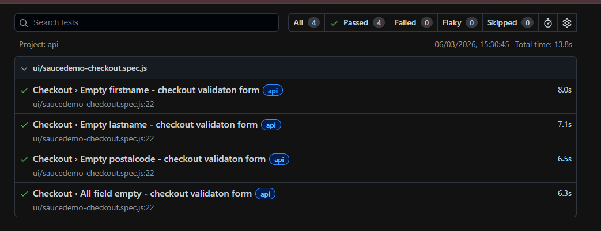
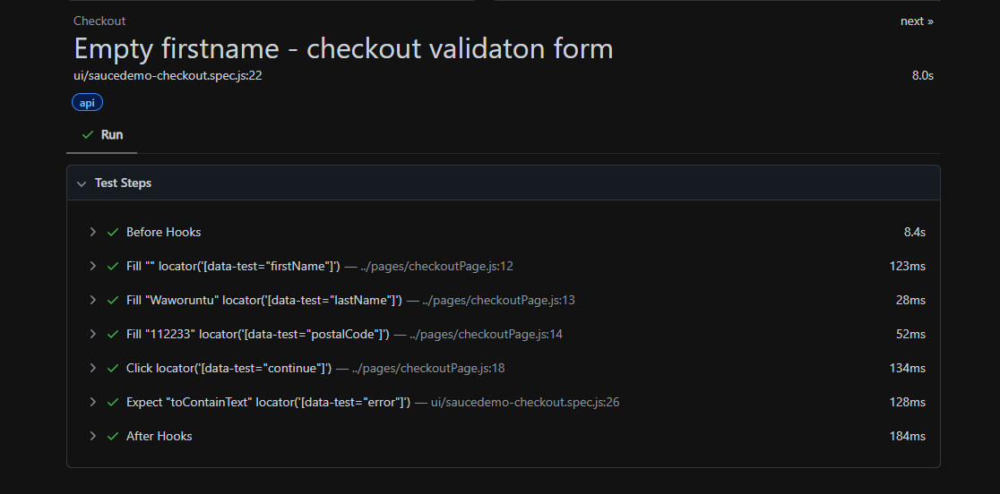

# Playwright QA Automation Project

This repository contains a **mini automation testing framework** built using **Playwright with JavaScript** to demonstrate both **UI Automation Testing and API Testing**.

The project automates an end-to-end purchase flow on a demo e-commerce website and includes API test scenarios using a public REST API.

---

# Project Scope

This project covers two types of testing:

UI Automation Testing  
- Automated end-to-end purchase flow on SauceDemo website

API Testing  
- API testing using DummyJSON public REST API

---

# Tech Stack

Automation Framework:
- Playwright

Programming Language:
- JavaScript

Runtime Environment:
- Node.js

CI/CD:
- GitHub Actions

---

# UI Test Scenarios

Website: https://www.saucedemo.com

### Login
- Login with valid credentials
- Login validation scenarios

### Product Flow
- View product list
- Add product to cart
- Verify cart items

### Checkout Flow

Positive Case
- Complete purchase flow from login → cart → checkout → order confirmation

Negative Cases
- Checkout with empty first name
- Checkout with empty last name
- Checkout with empty postal code
- Validate required field error messages

---

# API Test Scenarios

API Source: https://dummyjson.com

Example API tests include:

- Get product list
- Validate API response status
- Validate response structure
- Verify returned data fields

These tests demonstrate basic **API automation testing using Playwright request context**.

---

# Automation Concepts Implemented

This project demonstrates several QA automation practices:

- Page Object Model (POM)
- Data Driven Testing
- UI Automation Testing
- API Automation Testing
- Positive and Negative Testing
- Reusable Helper Utilities (working on it)
- Organized Test Structure
- GitHub Actions CI Integration

---

# Project Structure
playwright-qa-automation
│
├── .github/workflows # CI automation
├── helpers # reusable utilities
├── pages # Page Object Model classes
├── test-data # data-driven test data
├── tests # UI and API test scripts
│
├── playwright.config.js
├── package.json
└── README.md

# Installation

Clone the repository

git clone https://github.com/gheawaworuntu/playwright-qa-automation.git
cd playwright-qa-automation

Install dependencies

npm install

Install Playwright browsers

npx playwright install

---

# Running Tests

Run all tests

npx playwright test

Run tests in headed mode

npx playwright test --headed

Run a specific test file

npx playwright test tests/checkout.spec.js

---

# Test Report

Playwright automatically generates an HTML test report after test execution.

To view the report:

npx playwright show-report

Example report:

# CI Automation

This project includes **GitHub Actions workflow** to automatically run Playwright tests during repository updates.

Automation workflow file:
.github/workflows

# Purpose of This Project

This project was created as part of my journey in learning **Automation Testing with Playwright**.

It demonstrates my ability to:

- Automate UI workflows
- Write API automation tests
- Implement Page Object Model
- Handle positive and negative scenarios
- Structure automation testing frameworks

---

# Author

**Ghea Waworuntu** 
 
Junior Software Quality Assurance  

Currently learning **Automation Testing with Playwright**

GitHub  
https://github.com/gheawaworuntu

